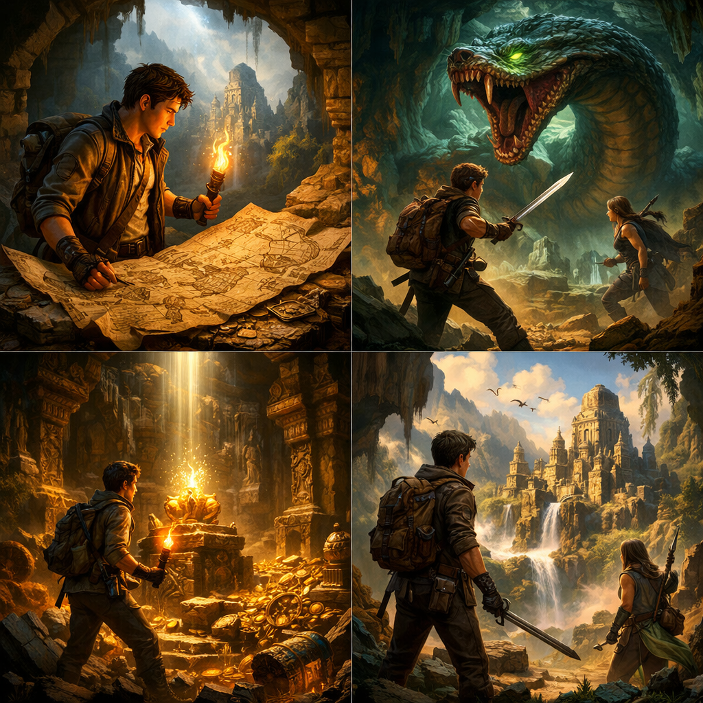

<!DOCTYPE html>
<html lang="pt-br">
<head>
  <meta charset="UTF-8">
  <title>Netflix Clone</title>
  <link rel="stylesheet" href="style.css">
</head>
<body>

  <!-- MENU -->
  <header>
    <h1>NETFLIX</h1>
    <button>Entrar</button>
  </header>
  <section class="movies">
  <h3>Populares</h3>

  

    
    alt="Young adventurer holding a torch and ancient map inside a misty cave with golden light streaming through openings, discovering legendary passages and treasures in a forgotten kingdom"
    
  

</section>

  <!-- BANNER -->
  <section class="banner">
    

      <h2>Filme em destaque</h2>
      
Em um reino esquecido pelo tempo, um jovem aventureiro descobre mapas antigos que revelam 
        passagens ocultas e tesouros lendários. Entre criaturas místicas, armadilhas traiçoeiras e
         segredos enterrados, ele precisa unir coragem e sabedoria para restaurar a glória perdida e 
         salvar seu povo.

      <button>Assistir</button>
    

  </section>

  <!-- FILMES -->
  <section class="movies">
    <h3>Populares</h3>
    

      
      
      
    

  </section>

</body>
</html>
